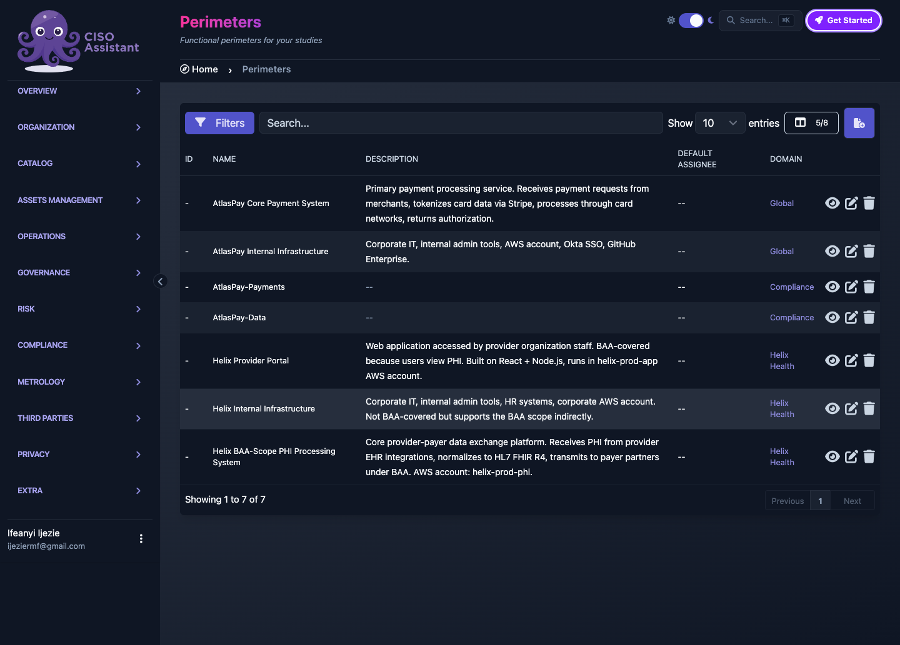
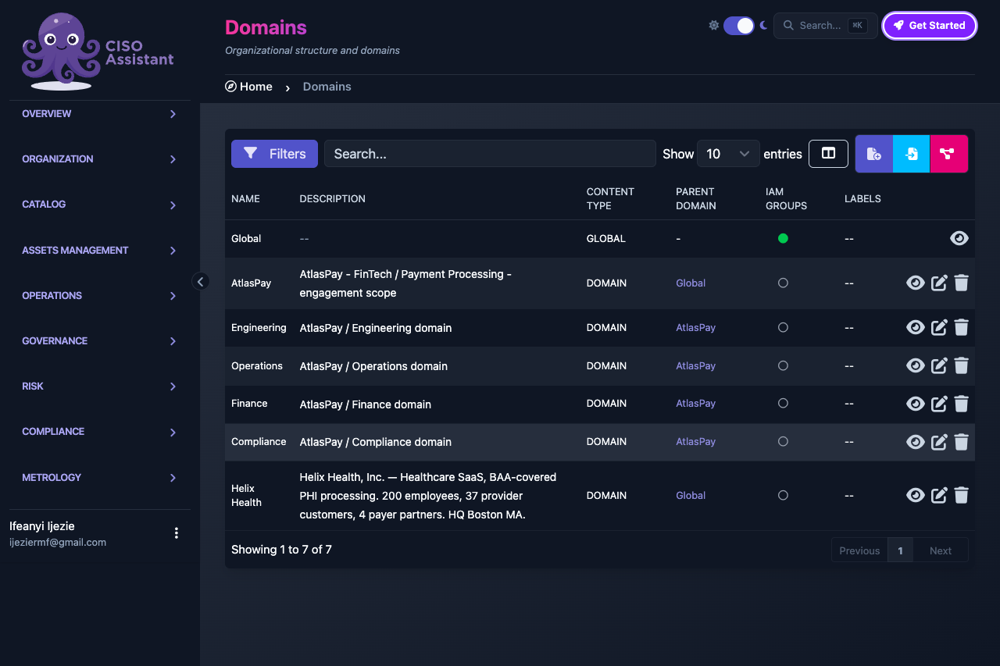
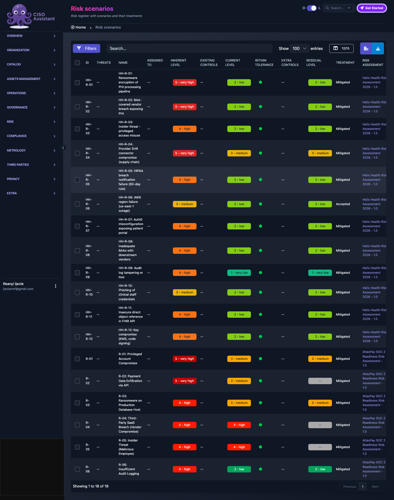
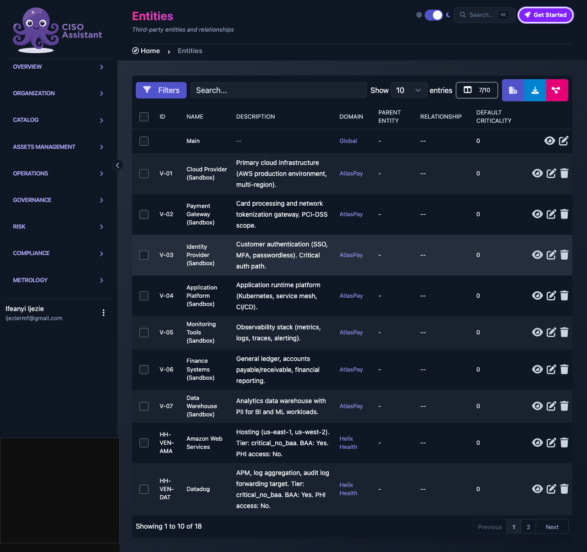

# AtlasPay FinTech SOC 2 Risk Assessment

> **SOC 2 Type 1 readiness for a FinTech payment processor, quantitative risk register, vendor tiering, and tabletop-tested incident response.**

---

## What This Demonstrates

| Capability | Details |
|---|---|
| **Engagement Type** | SOC 2 Type 1 readiness + risk assessment for a FinTech payment processor |
| **Methodology** | Quantitative 5×5 risk matrix, vendor criticality tiering, tabletop exercises |
| **Deliverables** | Risk register (6 scenarios), 7 MSA-tracked vendors, 4 policies, incident response runbook |
| **Stakeholder Focus** | Pre-audit posture for Q3 2026 SOC 2 audit, customer due diligence |
| **Industry Relevance** | FinTech, payment processing, PCI DSS (Payment Card Industry Data Security Standard) adjacent, SOC 2 audit-ready |

---

## Overview

AtlasPay is a 50-employee Financial Technology (FinTech) payment processor preparing for its first SOC 2 (Service Organization Control 2) Type 1 audit in Q3 2026. For a company moving money on behalf of customers and partners, SOC 2 is not just a compliance checkbox. It directly affects customer trust, partner onboarding requirements, fundraising conversations, and the ability to compete with larger processors that already have auditor-validated controls.

This engagement framed SOC 2 readiness as a business risk exercise, not an IT project. We identified six priority risk scenarios, tiered seven critical vendors against business impact, and designed tabletop exercises to test incident response discipline. Mid-engagement, we moved the GRC program from the original open-source platform to CISO Assistant Community Edition to gain better API coverage and long-term maintainability. That tooling decision is documented as a one-line governance note, because the underlying risk story did not change.

The final deliverables give AtlasPay's leadership and its future auditor a defensible pre-audit posture: a scored risk register, a vendor tier framework, tracked Master Service Agreements (MSAs), four foundational policies, and tested incident response scenarios.

---

## Deliverables

| Artifact | Purpose | Audience |
|---|---|---|
| **Risk Register (6 scenarios)** | Board and CISO view of exposure with inherent and residual scores | Leadership, auditors |
| **Vendor Inventory (7 vendors with tier classification)** | Third-party risk governance and review cadence | Procurement, compliance |
| **Contract Inventory (7 MSAs)** | Vendor governance evidence and coverage tracking | Legal, compliance |
| **Policy Library (4 policies)** | Operational requirements for access, incidents, awareness, and TPRM | Operational teams, auditors |
| **Tabletop Exercise Scenarios** | Incident response readiness and control validation | Security team, executives |
| **Risk Posture Documentation** | Pre-audit gap assessment and Q3 2026 hardening roadmap | Board, CISO, auditor |

*Figure 1: AtlasPay perimeters and risk framework configured inside the GRC platform.*

---

## Key Features

- ✅ Quantitative 5×5 risk matrix with inherent vs residual tracking
- ✅ Vendor criticality tiering (Tier 1 critical / Tier 2 important / Tier 3 deferrable)
- ✅ MSA (Master Service Agreement) coverage mapping per vendor with annual review cadence
- ✅ Tabletop-tested incident response procedures (multiple scenarios)
- ✅ SOC 2 Trust Services Criteria coverage across Security, Availability, and Confidentiality
- ✅ Pre-audit gap assessment identifying control areas for Q3 2026 hardening
- ✅ SOC 2 Type 1 readiness package: executive briefing + board-ready risk register + audit walkthrough findings + remediation roadmap

*Figure 2: Folder structure after the vendor cleanup, showing AtlasPay and Compliance domains separated.*

---

## SOC 2 Type 1 Readiness Package

The AtlasPay SOC 2 Type 1 readiness engagement produced a complete package of artifacts supporting pre-audit posture assessment and remediation planning. All artifacts are produced as part of a vCISO engagement using CISO Assistant v3.18.3 as the platform of record.

### Primary Deliverables

| Document | Purpose | Audience |
|---|---|---|
| **[AtlasPay SOC 2 Executive Briefing](deliverables/AtlasPay_SOC2_Executive_Briefing_v1.pdf)** (9 pages, 17 KB) | Board-ready executive briefing summarizing the engagement, findings, and recommendations | AtlasPay executive leadership, board of directors |
| **[AtlasPay SOC 2 Risk Register](deliverables/AtlasPay_SOC2_Risk_Register_v1.pdf)** (10 pages, 18 KB) | Appendix-grade risk register with full treatment narratives, scoring matrix, and risk acceptance statement | Board Risk Committee, SOC 2 audit team |

### Engagement Artifacts (Markdown Source)

| Document | Location | Purpose |
|---|---|---|
| Risk Register (full) | [lab/docs/soc2-risk-register.md](lab/docs/soc2-risk-register.md) | 6 risk scenarios with inherent/current/residual scoring and treatment plans |
| SOC 2 Control Mapping | [lab/docs/soc2-control-mapping.md](lab/docs/soc2-control-mapping.md) | 38 SOC 2 TSC criteria mapped to policies, risks, and vendors |
| Gap Assessment | [lab/docs/soc2-gap-assessment.md](lab/docs/soc2-gap-assessment.md) | 13 remediation items with severity, owner, target date |
| Audit Walkthrough | [lab/docs/soc2-audit-walkthrough.md](lab/docs/soc2-audit-walkthrough.md) | 10 walkthrough questions + 14 findings + management response |

### Engagement Summary

**Scope:** Common Criteria (CC) + Availability (A) + Confidentiality (C). Processing Integrity (PI) and Privacy (P) excluded.

**Risk Register (6 scenarios):**
- R-01 Privileged Account Compromise: residual Medium
- R-02 Payment Data Exfiltration via API: residual Medium
- R-03 Ransomware on Production DB: residual Medium
- **R-04 Third-Party SaaS Breach: residual High (formally accepted)**
- R-05 Insider Threat: residual Medium
- R-06 Insufficient Audit Logging: residual Low

**Audit Walkthrough Findings (14 total):**
- 0 Critical, 4 High, 7 Medium, 3 Low
- High findings: AW-02 Background checks, AW-03 Pen test, AW-04 Change mgmt, AW-06 Vuln scans
- All High findings have remediation targets by 2026-09-30

**Audit Opinion Target:** Unqualified SOC 2 Type 1 opinion in Q4 2026 audit window, contingent on completion of the four High-severity remediation items.

### Lab-Synthetic Disclosure

The risk register values, control mapping status, and audit walkthrough findings reflect a portfolio demonstration engagement. In a real SOC 2 Type 1 readiness engagement, these would be derived from AtlasPay's actual operational state, validated through interviews, observation, and inspection. The engagement methodology, document structure, and audit walkthrough pattern are directly applicable to real client work; the specific AtlasPay findings are illustrative.

---

## Sample Risk Register Entry

| Field | Example |
|---|---|
| **Risk ID** | AT-R-03 (Logging and monitoring gaps) |
| **Affected Assets** | Payment processing logs, SIEM pipeline, incident detection capability |
| **Business Impact** | Delayed breach detection, missed SOC 2 monitoring requirements, regulator scrutiny |
| **Inherent Risk** | High (4×3) |
| **Existing Controls** | Basic endpoint logging, manual log review, alerting on gateway errors |
| **Control Gaps** | No centralized SIEM, no correlation rules, no 24/7 monitoring coverage |
| **Treatment** | Deploy centralized logging + SIEM, build detection rules, define on-call rotation |
| **Residual Risk** | Low (2×2) post-treatment |

A second example shows how vendor exposure was treated:

| Field | Example |
|---|---|
| **Risk ID** | AT-R-05 (Third-party and vendor risk management) |
| **Affected Assets** | Payment gateway, cloud infrastructure, identity provider, data warehouse |
| **Business Impact** | Supply-chain breach, payment processor penalties, customer notification obligations |
| **Inherent Risk** | High (4×3) |
| **Existing Controls** | Informal vendor reviews, signed MSAs, ad-hoc security questionnaires |
| **Control Gaps** | No formal TPRM program, no criticality tiering, no recurring review cadence |
| **Treatment** | Implement TPRM policy, tier vendors, schedule quarterly Tier 1 reviews |
| **Residual Risk** | Medium (3×2) post-treatment |

*Figure 3: The six risk scenarios loaded into the GRC platform risk register.*

---

## Sample Vendor Tier

| Vendor | Tier | Criticality | MSA Status | Review Cadence |
|---|---|---|---|---|
| **Payment Gateway** | Tier 1 | Critical | Executed 2025-Q4 | Quarterly |
| **Cloud Provider** | Tier 1 | Critical | Executed 2025-Q1 | Quarterly |
| **Identity Provider** | Tier 1 | Critical | Executed 2025-Q2 | Quarterly |
| **Monitoring Tools** | Tier 2 | Important | Executed 2025-Q3 | Semi-annual |
| **Finance Systems** | Tier 2 | Important | Executed 2025-Q3 | Semi-annual |
| **Data Warehouse** | Tier 2 | Important | Executed 2025-Q4 | Semi-annual |
| **Application Platform** | Tier 3 | Deferrable | Executed 2026-Q1 | Annual |

The tiering logic is straightforward: any vendor whose failure would stop payment processing, block authentication, or break cloud availability is Tier 1. Tools that support operations but have workable alternatives are Tier 2. Deferrable platforms are Tier 3 and reviewed annually.

*Figure 4: Seven AtlasPay vendors grouped under the AtlasPay folder after the tiering cleanup.*

---

## Why This Matters

For a FinTech CISO, SOC 2 readiness is a revenue and trust problem, not a paperwork problem. Customers and partners increasingly require a SOC 2 report before they will integrate payments or store funds. Investors treat it as a maturity signal. A failed or delayed audit can stall a deal or trigger costly remediation under pressure.

A pre-audit risk assessment like this one does three things. First, it surfaces gaps while there is still time to fix them before the auditor arrives. Second, it creates a documented, repeatable risk language that the board, auditors, and engineers can all use. Third, it ties each control investment to a specific risk scenario, so security spend is defensible rather than reactive.

The result is not perfect security. It is an auditable, risk-informed foundation that AtlasPay can build on through Q3 2026 and beyond.

---

## Value to GRC Consulting

| Service | Application |
|---|---|
| **SOC 2 Type 1 Readiness** | Pre-audit posture assessment and gap identification |
| **Vendor Risk Tiering** | Third-party risk framework and review cadence |
| **Risk Register Development** | Quantitative scoring + treatment planning |
| **Tabletop Exercise Design** | Incident response readiness and control validation |

---

## Tools & Frameworks

| Tool/Framework | Use |
|---|---|
| **SOC 2 Trust Services Criteria 2022** | Audit criteria for Security, Availability, and Confidentiality |
| **NIST Cybersecurity Framework 2.0** | Risk taxonomy and control organization |
| **PCI DSS 4.0** | Adjacent card-data environment guidance |
| **CISO Assistant CE** | GRC platform for risk, vendor, policy, and incident tracking |

---

## Key Takeaways

1. **SOC 2 readiness should start with business risk, not control catalogs.** Mapping controls to real risk scenarios makes the audit story coherent.
2. **Vendor tiering is governance, not procurement.** When payment processing depends on three external providers, their review cadence is a board-level decision.
3. **Residual risk tells the truth.** Inherent risk motivates action; residual risk shows whether the action worked.
4. **Tabletop exercises expose gaps that documents hide.** A written incident response policy is only evidence once it has been rehearsed.

---

## Related Projects

- [AtlasPay Risk Assessment](https://github.com/ijeziermf/AtlasPay-Risk-Assessment): NIST SP 800-53 Rev. 5 risk assessment with heat map and treatment plan
- [AtlasPay Risk Profile & BCP](https://github.com/ijeziermf/AtlasPay-Risk-Profile-BCP): Business continuity plan and organizational risk profile
- [Cyber-Security Policy Library](https://github.com/ijeziermf/Cyber-Security-Policy-Library): NIST-aligned policy templates used across sandboxes
- [Helix Health GRC Sandbox](https://github.com/ijeziermf/helix-health-grc-sandbox): HIPAA + SOC 2 readiness for a HealthTech SaaS
- [Meridian Bank GRC Sandbox](https://github.com/ijeziermf/meridian-bank-grc-sandbox): Community bank risk and compliance program

---

## License

This project is for educational and portfolio demonstration purposes. Organizations may adapt the methodology for internal use.
